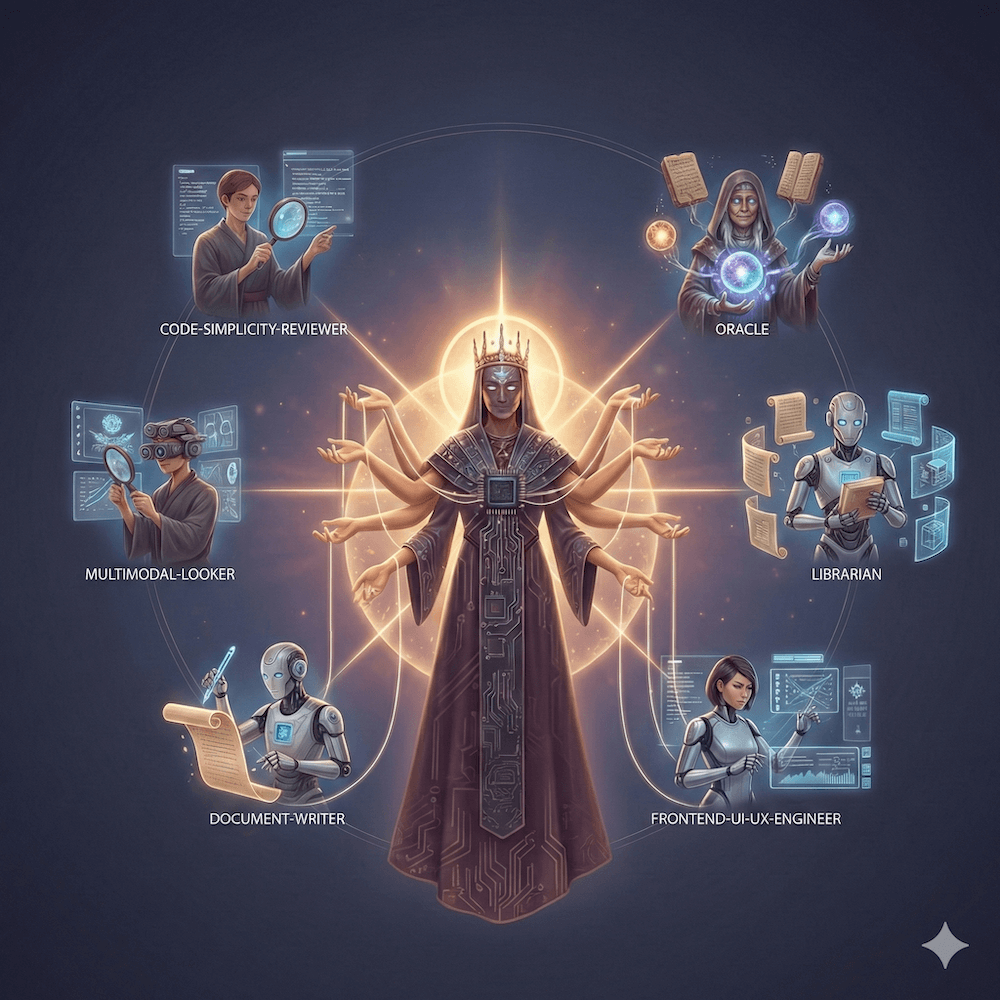

<div align="center">

# oh-my-opencode-slim

**A lightweight, powerful agent orchestration plugin for OpenCode**



*Transform your AI assistant into a manager capable of delegating complex tasks to specialized sub-agents, running searches in the background, and managing multi-step workflows with ease.*

</div>

> Slimmed-down fork of [oh-my-opencode](https://github.com/code-yeongyu/oh-my-opencode) — focused on core agent orchestration without the extra bells and whistles.

---

## Installation

### For Humans

Run the interactive installer:

```bash
bunx oh-my-opencode-slim install
```

Or use non-interactive mode:

```bash
bunx oh-my-opencode-slim install --no-tui --antigravity=yes --openai=yes --cerebras=no
```

**Alternative: Ask any coding agent**

Paste this into Claude Code, AmpCode, Cursor, or any coding agent:

```
Install and configure by following the instructions here:
https://raw.githubusercontent.com/alvinunreal/oh-my-opencode-slim/refs/heads/master/README.md
```

### For LLM Agents

<details>
<summary>Instructions for LLM Agents (click to expand)</summary>

If you're an LLM Agent helping set up oh-my-opencode-slim, follow these steps **exactly in order**. Ask questions **one at a time** and wait for the user's response before proceeding.

---

#### Step 1: Check OpenCode Installation

First, verify OpenCode is installed:

```bash
if command -v opencode &> /dev/null; then
    echo "OpenCode $(opencode --version) is installed"
else
    echo "OpenCode is not installed. Please install it first."
    echo "Ref: https://opencode.ai/docs"
fi
```

If OpenCode is not installed, **STOP** and ask the user to install it first.

---

#### Step 2: Ask About Provider Access (ONE QUESTION AT A TIME)

**IMPORTANT**: Ask these questions **one by one**. Wait for the user's answer before asking the next question. Store their answers to determine the final configuration.

**Question 1** (ask first, wait for response):
> "Do you have an **Antigravity** subscription? (yes/no)"
> 
> *Antigravity provides access to Claude and Gemini models via the `google/` prefix.*

**Question 2** (ask after Question 1 is answered):
> "Do you have access to **OpenAI** API? (yes/no)"
> 
> *This enables `openai/` models like GPT-5.2 Codex.*

**Question 3** (ask after Question 2 is answered):
> "Do you have access to **Cerebras** API? (yes/no)"
> 
> *This enables `cerebras/` models for fast exploration tasks.*

---

#### Step 3: Run the Installer

Based on the user's answers, run the installer with appropriate flags:

```bash
bunx oh-my-opencode-slim install --no-tui --antigravity=<yes|no> --openai=<yes|no> --cerebras=<yes|no>
```

**Examples:**
- User has Antigravity + OpenAI: `bunx oh-my-opencode-slim install --no-tui --antigravity=yes --openai=yes --cerebras=no`
- User has only OpenAI: `bunx oh-my-opencode-slim install --no-tui --antigravity=no --openai=yes --cerebras=no`
- User has Cerebras only: `bunx oh-my-opencode-slim install --no-tui --antigravity=no --openai=no --cerebras=yes`

---

#### Alternative: Manual Configuration

If the installer doesn't work, create the configuration files manually:

##### 3a. Create `~/.config/opencode/opencode.json`

**If user has Antigravity (regardless of other providers):**
```json
{
  "plugin": [
    "oh-my-opencode-slim",
    "opencode-antigravity-auth@latest"
  ],
  "provider": {
    "google": {
      "name": "Google",
      "models": {
        "gemini-3-pro-high": {
          "name": "Gemini 3 Pro High",
          "limit": { "context": 1048576, "output": 65535 }
        },
        "gemini-3-flash": {
          "name": "Gemini 3 Flash",
          "limit": { "context": 1048576, "output": 65536 }
        },
        "claude-opus-4-5-thinking": {
          "name": "Claude Opus 4.5 Thinking",
          "limit": { "context": 200000, "output": 32000 }
        }
      }
    }
  }
}
```

**If user does NOT have Antigravity:**
```json
{
  "plugin": [
    "oh-my-opencode-slim"
  ]
}
```

##### 3b. Create `~/.config/opencode/oh-my-opencode-slim.json`

Select the appropriate configuration based on the user's answers:

**Scenario A: Antigravity ONLY (no OpenAI, no Cerebras)**
```json
{
  "agents": {
    "orchestrator": { "model": "google/claude-opus-4-5-thinking" },
    "oracle": { "model": "google/claude-opus-4-5-thinking" },
    "librarian": { "model": "google/gemini-3-flash" },
    "explore": { "model": "google/gemini-3-flash" },
    "frontend-ui-ux-engineer": { "model": "google/gemini-3-flash" },
    "document-writer": { "model": "google/gemini-3-flash" },
    "multimodal-looker": { "model": "google/gemini-3-flash" },
    "code-simplicity-reviewer": { "model": "google/claude-opus-4-5-thinking" }
  }
}
```

**Scenario B: Antigravity + OpenAI (no Cerebras)**
```json
{
  "agents": {
    "orchestrator": { "model": "google/claude-opus-4-5-thinking" },
    "oracle": { "model": "openai/gpt-5.2-codex" },
    "librarian": { "model": "google/gemini-3-flash" },
    "explore": { "model": "google/gemini-3-flash" },
    "frontend-ui-ux-engineer": { "model": "google/gemini-3-flash" },
    "document-writer": { "model": "google/gemini-3-flash" },
    "multimodal-looker": { "model": "google/gemini-3-flash" },
    "code-simplicity-reviewer": { "model": "google/claude-opus-4-5-thinking" }
  }
}
```

**Scenario C: Antigravity + Cerebras (no OpenAI)**
```json
{
  "agents": {
    "orchestrator": { "model": "google/claude-opus-4-5-thinking" },
    "oracle": { "model": "google/claude-opus-4-5-thinking" },
    "librarian": { "model": "google/gemini-3-flash" },
    "explore": { "model": "cerebras/zai-glm-4.6" },
    "frontend-ui-ux-engineer": { "model": "google/gemini-3-flash" },
    "document-writer": { "model": "google/gemini-3-flash" },
    "multimodal-looker": { "model": "google/gemini-3-flash" },
    "code-simplicity-reviewer": { "model": "google/claude-opus-4-5-thinking" }
  }
}
```

**Scenario D: Antigravity + OpenAI + Cerebras (full access)**
```json
{
  "agents": {
    "orchestrator": { "model": "google/claude-opus-4-5-thinking" },
    "oracle": { "model": "openai/gpt-5.2-codex" },
    "librarian": { "model": "google/gemini-3-flash" },
    "explore": { "model": "cerebras/zai-glm-4.6" },
    "frontend-ui-ux-engineer": { "model": "google/gemini-3-flash" },
    "document-writer": { "model": "google/gemini-3-flash" },
    "multimodal-looker": { "model": "google/gemini-3-flash" },
    "code-simplicity-reviewer": { "model": "google/claude-opus-4-5-thinking" }
  }
}
```

**Scenario E: OpenAI ONLY (no Antigravity, no Cerebras)**
```json
{
  "agents": {
    "orchestrator": { "model": "openai/gpt-5.2-codex" },
    "oracle": { "model": "openai/gpt-5.2-codex" },
    "librarian": { "model": "openai/gpt-4.1-mini" },
    "explore": { "model": "openai/gpt-4.1-mini" },
    "frontend-ui-ux-engineer": { "model": "openai/gpt-4.1-mini" },
    "document-writer": { "model": "openai/gpt-4.1-mini" },
    "multimodal-looker": { "model": "openai/gpt-4.1-mini" },
    "code-simplicity-reviewer": { "model": "openai/gpt-5.2-codex" }
  }
}
```

**Scenario F: OpenAI + Cerebras (no Antigravity)**
```json
{
  "agents": {
    "orchestrator": { "model": "openai/gpt-5.2-codex" },
    "oracle": { "model": "openai/gpt-5.2-codex" },
    "librarian": { "model": "openai/gpt-4.1-mini" },
    "explore": { "model": "cerebras/zai-glm-4.6" },
    "frontend-ui-ux-engineer": { "model": "openai/gpt-4.1-mini" },
    "document-writer": { "model": "openai/gpt-4.1-mini" },
    "multimodal-looker": { "model": "openai/gpt-4.1-mini" },
    "code-simplicity-reviewer": { "model": "openai/gpt-5.2-codex" }
  }
}
```

**Scenario G: Cerebras ONLY (no Antigravity, no OpenAI)**
```json
{
  "agents": {
    "orchestrator": { "model": "cerebras/zai-glm-4.6" },
    "oracle": { "model": "cerebras/zai-glm-4.6" },
    "librarian": { "model": "cerebras/zai-glm-4.6" },
    "explore": { "model": "cerebras/zai-glm-4.6" },
    "frontend-ui-ux-engineer": { "model": "cerebras/zai-glm-4.6" },
    "document-writer": { "model": "cerebras/zai-glm-4.6" },
    "multimodal-looker": { "model": "cerebras/zai-glm-4.6" },
    "code-simplicity-reviewer": { "model": "cerebras/zai-glm-4.6" }
  }
}
```

---

#### Step 4: Verify Configuration

```bash
opencode --version  # Should be 1.0.150 or higher
cat ~/.config/opencode/opencode.json
cat ~/.config/opencode/oh-my-opencode-slim.json
```

---

#### Step 5: Configure Authentication

Guide the user to authenticate with their providers:

**For Antigravity users:**
```bash
opencode auth login
# Select: Google → OAuth with Google (Antigravity)
```

**For OpenAI users:**
```bash
# Set OPENAI_API_KEY environment variable
export OPENAI_API_KEY="sk-..."
```

**For Cerebras users:**
```bash
# Set CEREBRAS_API_KEY environment variable
export CEREBRAS_API_KEY="..."
```

---

#### Step 6: Print Final Instructions for User

After writing the configuration files, print this message:

```
Configuration complete!

To authenticate with your providers, run:

    $ opencode auth login

After authentication, start OpenCode:

    $ opencode
```

---

#### Quick Reference: Provider to Scenario Mapping

| Antigravity | OpenAI | Cerebras | Scenario | Auth Plugin Required |
|:-----------:|:------:|:--------:|:--------:|:--------------------:|
| Yes | No | No | A | Yes |
| Yes | Yes | No | B | Yes |
| Yes | No | Yes | C | Yes |
| Yes | Yes | Yes | D | Yes |
| No | Yes | No | E | No |
| No | Yes | Yes | F | No |
| No | No | Yes | G | No |

</details>

---

## Architecture & Flow

The plugin follows a "Hub and Spoke" model:

1. **The Orchestrator (Hub)**: The main entry point for user requests. It analyzes the task and decides which specialized agents to call.
2. **Specialized Agents (Spokes)**: Domain-specific experts (e.g., UI/UX, Documentation, Architecture) that handle narrow tasks with high precision.
3. **Background Manager**: A robust engine that allows the Orchestrator to "fire and forget" tasks (like deep codebase searches or documentation research) while continuing to work on other parts of the problem.

### The Flow of a Request

1. **User Prompt**: "Refactor the auth logic and update the docs."
2. **Orchestrator**: Creates a TODO list.
3. **Delegation**:
   - Launches an `@explore` background task to find all auth-related files.
   - Launches a `@librarian` task to check the latest documentation for the auth library used.
4. **Integration**: Once background results are ready, the Orchestrator performs the refactor.
5. **Finalization**: Passes the changes to `@document-writer` to update the README.

---

## Agents

| Agent | Role | Default Model | Best Used For |
| :--- | :--- | :--- | :--- |
| **orchestrator** | Manager | `google/claude-opus-4-5-thinking` | Planning, task delegation, and overall coordination. |
| **oracle** | Architect | `openai/gpt-5.2-codex` | Complex debugging, architectural decisions, and code reviews. |
| **explore** | Searcher | `cerebras/zai-glm-4.6` | Fast codebase grep, finding patterns, and locating definitions. |
| **librarian** | Researcher | `google/gemini-3-flash` | External library docs, GitHub examples, and API research. |
| **frontend-ui-ux-engineer** | Designer | `google/gemini-3-flash` | Visual changes, CSS/styling, and React/Vue component polish. |
| **document-writer** | Scribe | `google/gemini-3-flash` | Technical documentation, READMEs, and inline code comments. |
| **multimodal-looker** | Visionary | `google/gemini-3-flash` | Analyzing screenshots, wireframes, or UI designs. |
| **code-simplicity-reviewer** | Minimalist | `google/claude-opus-4-5-thinking` | Ruthless code simplification and YAGNI principle enforcement. |

---

## Tools & Capabilities

### Background Tasks

The plugin provides three core tools to manage asynchronous work:

- `background_task`: Launches an agent in a new session.
  - `sync=true`: Blocks until the agent finishes (ideal for quick sub-tasks).
  - `sync=false`: Runs in the background (ideal for long searches or research).
- `background_output`: Fetches the result of a background task using its ID.
- `background_cancel`: Aborts running tasks if they are no longer needed.

---

## Configuration

You can customize the behavior of the plugin via JSON configuration files.

### Configuration Files

The plugin looks for configuration in two places (and merges them):

1. **User Global**: `~/.config/opencode/oh-my-opencode-slim.json` (or OS equivalent)
2. **Project Local**: `./.opencode/oh-my-opencode-slim.json`

| Platform | User Config Path |
| :--- | :--- |
| **Windows** | `~/.config/opencode/oh-my-opencode-slim.json` or `%APPDATA%\opencode\oh-my-opencode-slim.json` |
| **macOS/Linux** | `~/.config/opencode/oh-my-opencode-slim.json` |

### Disabling Agents

You can disable specific agents using the `disabled_agents` array:

```json
{
  "disabled_agents": ["multimodal-looker", "code-simplicity-reviewer"]
}
```

---

## Uninstallation

1. **Remove the plugin from your OpenCode config**:

   Edit `~/.config/opencode/opencode.json` and remove `"oh-my-opencode-slim"` from the `plugin` array.

2. **Remove configuration files (optional)**:
   ```bash
   rm -f ~/.config/opencode/oh-my-opencode-slim.json
   rm -f .opencode/oh-my-opencode-slim.json
   ```

---

## Credits

This is a slimmed-down fork of [oh-my-opencode](https://github.com/code-yeongyu/oh-my-opencode) by [@code-yeongyu](https://github.com/code-yeongyu).

---

## License

MIT
